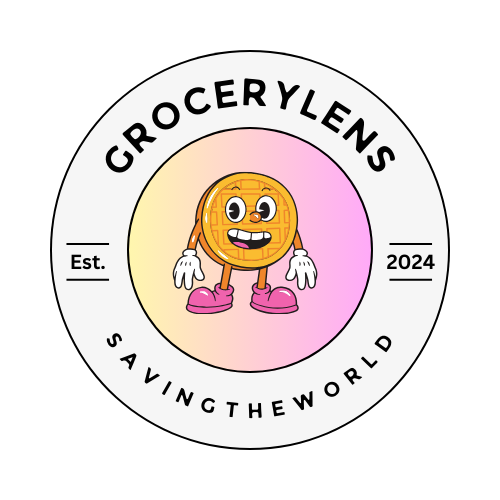

# GroceryLens 

GroceryLens is an AI powered mobile application that aims to help users reduce 
food waste by turning ingredients they have into recipe ideas.
The application combines Machine learning components (Computer Vision and Natural Language Processing)
to achieve this goal.

## Tech Stack
GroceryLens was built using the following:
- **Java & XML**
- **Python**
- **OpenCV**
- **YOLOv8**
- **Android Studio**
- **TensorFlow Lite**
- **Firebase Authentication** 
- **Firebase Realtime Database** 
- **Google Cloud Run** 
- **Spoonacular API**

---
## Features

### Food Image Detection

A YOLOv8 model was trained on a curated dataset of 17 food classes [Common Food Items Dataset (Kaggle)](https://www.kaggle.com/datasets/michaelorebela/common-food-items-dataset)
consisting of:

['banana', 'beef', 'bread', 'broccoli', 'cheese', 'chicken', 'cucumber', 'egg', 'fish', 'lemon', 'lettuce', 'milk', 
'mushroom', 'onion', 'orange', 'potato', 'tomato'].

Ingredients are detected and then sent to customisation screen for recipe generation.
The model runs fully on-device for fast inference

  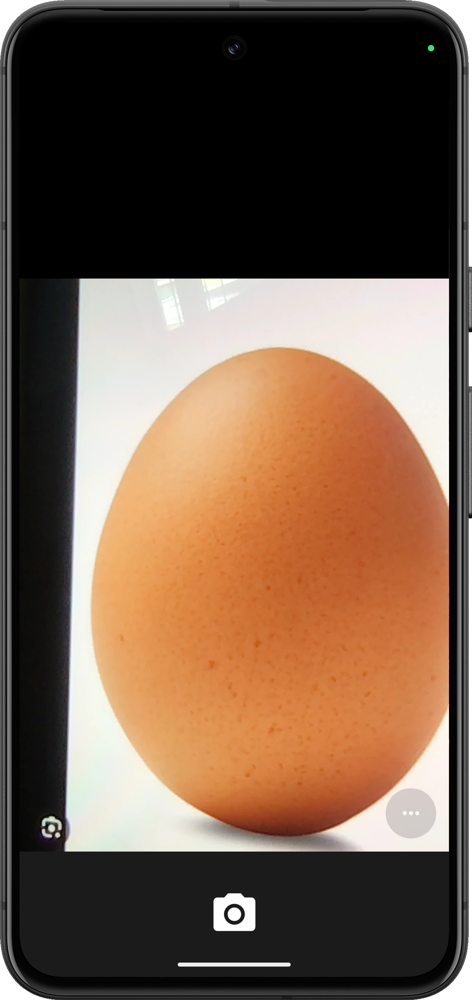
  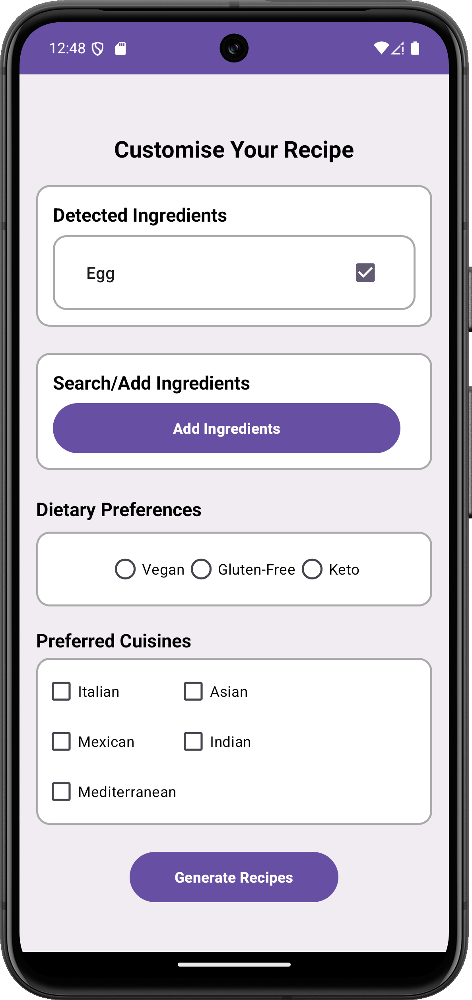

### NLP Voice Detection

GroceryLens allows users to input ingredients through **voice commands**.
To process the input, a **DistillBERT FoodBERT NER API** was developed using:

[chambliss/distilbert-for-food-extraction](https://huggingface.co/chambliss/distilbert-for-food-extraction)
and then Hosted as a REST API on **Google Cloud Run**.

This processes free-form voice text into extracted ingredient names.

For example:
> **Voice input:** *"I have an egg, three grams of flour, and a bottle of milk."*  
> **Extracted ingredients:** `[egg, flour, milk]`

Note on the first use, the API may experience a **cold start delay**.

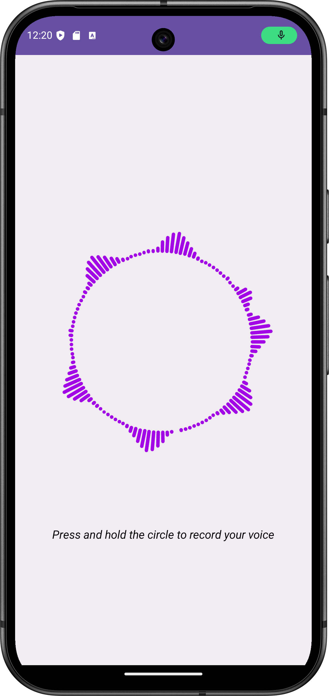

### Recipe Generation

**Spoonacular API** is used to generate recipe ideas based on the selected ingredients.

Users are able to customise recipe search with **Dietary preferences** and **Cuisines**.
Detailed recipe information is returned and recipes can be saved to favourites for future reference.

  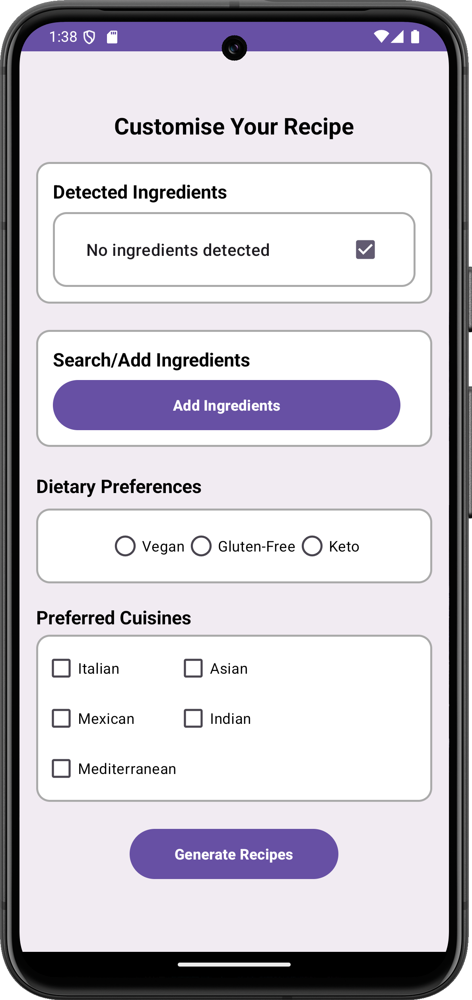
  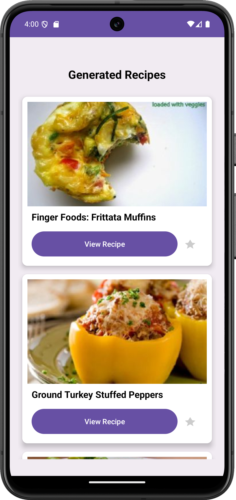
  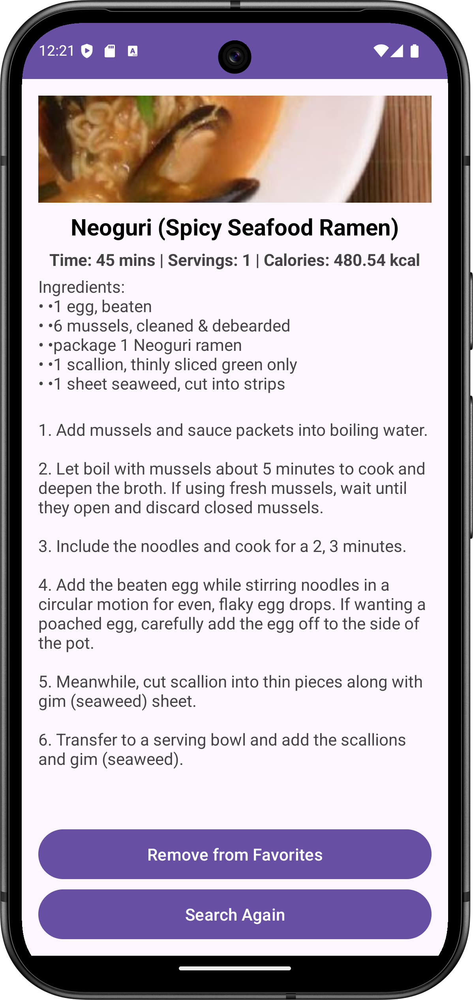
  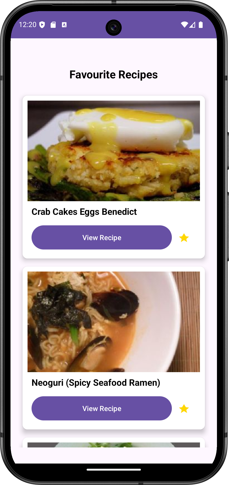

### Gamification 

GroceryLens also includes a gamified experience to encourage continued application usage.
Users progress through levels based on the number of recipes viewed.

A Circular progress indicator and badge system can be seen on the landing page,
and user progress is stored in Firebase Realtime Database and synced across devices.

    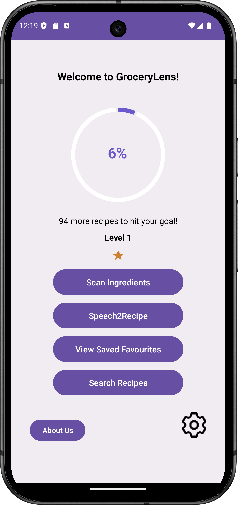
    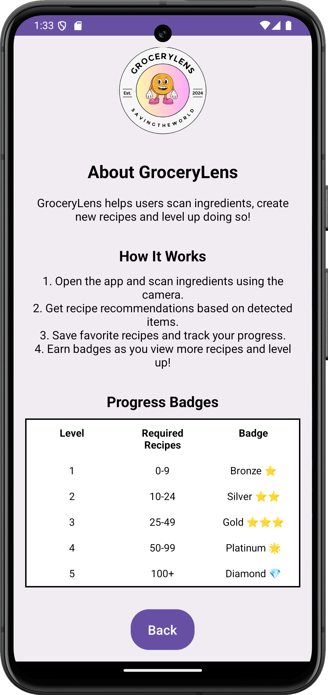

---

## Computer Vision Training 

YOLOv8s was used as the model of choice.
- 300 training epochs
- Optimizer: AdamW
- Learning rate: 0.001
- Batch size: 128
- Dataset included both **manually labeled data** and **pseudo-labelled images** from semi-supervised learning
- Trained using Google Colab **A100 GPU**

### Final Results
- mAP@0.5:0.95 **85.43%**
- Precision: **93.25%**
- Recall: **86.01%**
- Average inference time on device: **438 ms**

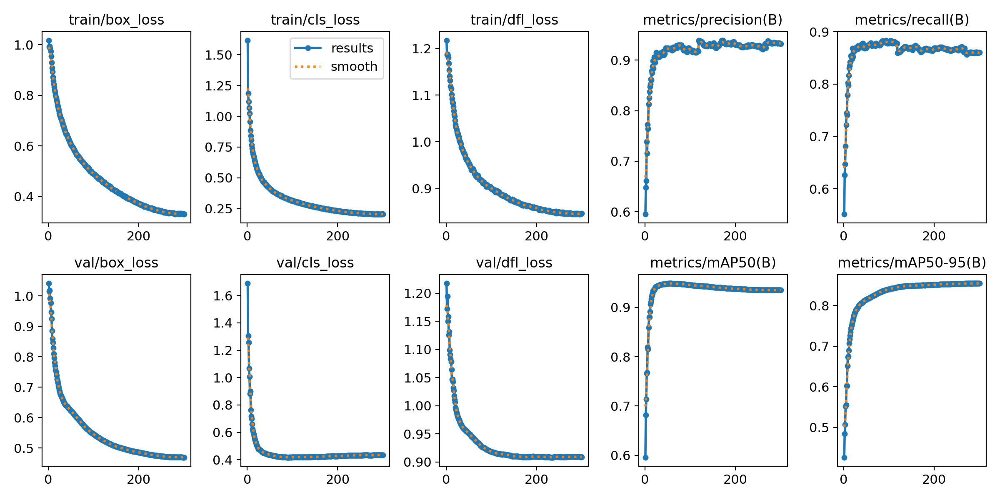

---
# Acknowledgements:

This project was completed as part of my Final Year Project for the BEng Software Engineering degree at the University of Westminster.
I would like to thank my supervisor Dr Alexandra Psarrou, for her invaluable guidance throughout the development of this project.

# Contact Details
LinkedIn: https://www.linkedin.com/in/michael-o-a6b096272/

